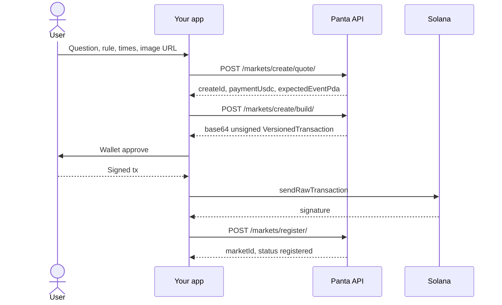

Panta never holds private keys. Every write that touches Solana is a **session**:

1. **Quote** — validate inputs, lock a short-lived intent, return price.
2. **Build** — return an unsigned `VersionedTransaction` or instruction list plus a recent blockhash.
3. **Sign + broadcast** — your app asks the user’s wallet to sign, then you send the tx on **your** RPC.
4. **Confirm** — send Panta the signature so we can verify on-chain and update catalog / attribution.

## Create market

Sessions (`createId`) last about **5 minutes**. Rebuild if the blockhash expires (~60s). Do not edit accounts or fee amounts; register checks the chain against the quote.

Creating a market requires a public catalog `imageUrl` (recommended **1024×1024** square). Soft-validated URL rules — see [Quote a market](/api-reference/markets/quote). Optional fields include `region`, `oracle`, and (for breaking markets) `eventInProgress`.

## Primary buy

Same pattern, different ids:

| Step | Id |
| --- | --- |
| Quote | `quoteId` (~90s) |
| Build | `orderId` (~120s) |
| After broadcast | submit and/or verify with `signature` |

Primary buy **build** returns **instructions** (not a fully assembled tx). Compile a versioned transaction from `instructions` + `recentBlockhash`, then sign.

Optional `userId` / `X-User-Id` on quote and build ties the order to an attribution id (defaults to the authenticated account).

If the curve moved more than `maxSlippageBps` between quote and build, you get `QUOTE_STALE` — requote.

## What Panta verifies

On register / trade report, verification is fail-closed: the transaction must exist, succeed, include the expected wallet, market, and program, and match quoted fees where applicable.

| Code | Meaning |
| --- | --- |
| `TX_NOT_FOUND` | Signature not seen at the required commitment |
| `TX_FAILED` | On-chain error |
| `TX_MISMATCH` | Wrong wallet, market, or program |
| `TX_FEE_MISMATCH` | Amount does not match the quote |

## Safe retries

| Call | Idempotent when |
| --- | --- |
| `POST /markets/register/` | Same `createId` + `signature` |
| `POST /trades/` | Same `signature` |
| `POST /primaryordersubmit/` | Same `orderId` + `signature` |
