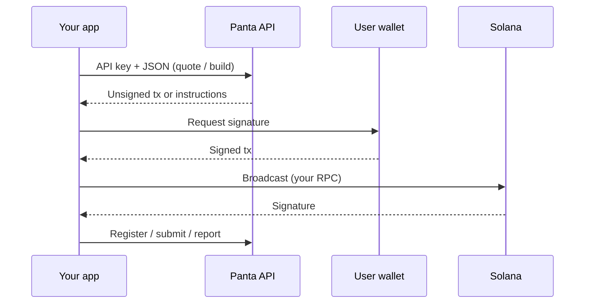

**Panta** is a binary YES/NO prediction market on Solana. This API lets your app create markets, buy primary shares, read positions, build claim transactions, and report trades.

You never custody wallets. Panta returns unsigned transactions (or instruction lists). The user’s wallet signs. You broadcast on **your** RPC, then tell Panta the signature.

<Info>
Base path: `https://{host}/api/v1`. Trailing slashes are required. Authenticate every route with `X-Api-Key`.
</Info>

## What you can do

<CardGroup cols={2}>
  <Card title="Create a market" icon="plus" href="/api-reference/markets/overview">
    Quote the USDC creation fee, build an unsigned tx, register after broadcast.
  </Card>
  <Card title="Primary buy" icon="chart-line" href="/api-reference/orders/overview">
    Quote a YES/NO fill on the bonding curve, build instructions, submit the signature.
  </Card>
  <Card title="Positions" icon="wallet" href="/api-reference/positions">
    List a wallet’s USDC holdings, phase, and claim eligibility.
  </Card>
  <Card title="Claim winnings" icon="trophy" href="/api-reference/claims/build">
    Build unsigned claim instructions when a resolved market is claimable.
  </Card>
  <Card title="Trade attribution" icon="receipt" href="/api-reference/trades/report">
    Verify on-chain buys and claims for volume reporting.
  </Card>
  <Card title="Account and keys" icon="key" href="/api-reference/account/get">
    Profile, usage, and API key lifecycle for your integration.
  </Card>
</CardGroup>

## Custody model

Panta cooks the transaction. The user signs. You file it on-chain. Then you send the receipt.

## Amounts

| Surface | Format |
| --- | --- |
| Create market | USDC **base units** as integer strings (6 decimals), e.g. `"50000000"` = 50 USDC |
| Primary buy | Human-readable **decimal strings**, e.g. `"20.00"` |

## Next

<CardGroup cols={2}>
  <Card title="Quickstart" icon="rocket" href="/quickstart">
    Get a key and make your first request.
  </Card>
  <Card title="How it works" icon="diagram-project" href="/guides/how-it-works">
    Quote → build → sign → broadcast → confirm.
  </Card>
</CardGroup>
